# Асинхронность в JS

- Callbacks
- Событийный цикл
- Promises
- Promises API
- Async Await
- Generators

---

## Введение

Многие действия в JavaScript асинхронные.

```
function loadScript(src) {
  let script = document.createElement('script');
  script.src = src;
  document.head.append(script);
}

// загрузит и выполнит скрипт
loadScript('/my/script.js');
```

Такие функции называют «асинхронными», потому что действие (загрузка скрипта) будет завершено не сейчас, а потом.

---

## Введение

Но если мы просто вызовем эту функцию после loadScript(…), у нас ничего не выйдет:

```
loadScript('/my/script.js'); // в скрипте есть "function newFunction() {…}"

newFunction(); // такой функции не существует!
```

---

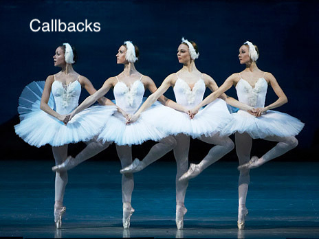

---

## Callbacks

Давайте передадим функцию callback вторым аргументом в loadScript, чтобы вызвать её, когда скрипт загрузится:

```
function loadScript(src, callback) {
  let script = document.createElement('script');
  script.src = src;

  script.onload = () => callback(script);

  document.head.append(script);
}
```

---

## Callbacks

Вызов функции

```
loadScript('/my/script.js', function() {
  // эта функция вызовется после того, когда загрузится скрипт
  newFunction(); // теперь всё работает
  ...
});
```

---

## Callbacks

### Перехват ошибок

В примере выше мы не думали об ошибках. А что если загрузить скрипт не удалось?

Ниже улучшенная версия loadScript, которая умеет отслеживать ошибки загрузки:

```
function loadScript(src, callback) {
  let script = document.createElement('script');
  script.src = src;

  script.onload = () => callback(null, script);
  script.onerror = () => callback(new Error(`Не удалось загрузить скрипт ${src}`));

  document.head.append(script);
}
```

---

## Callbacks

## Перехват ошибок

Вызов функции

```
loadScript('/my/script.js', function(error, script) {
  if (error) {
    // обрабатываем ошибку
  } else {
    // скрипт успешно загружен
  }
});
```

---


---

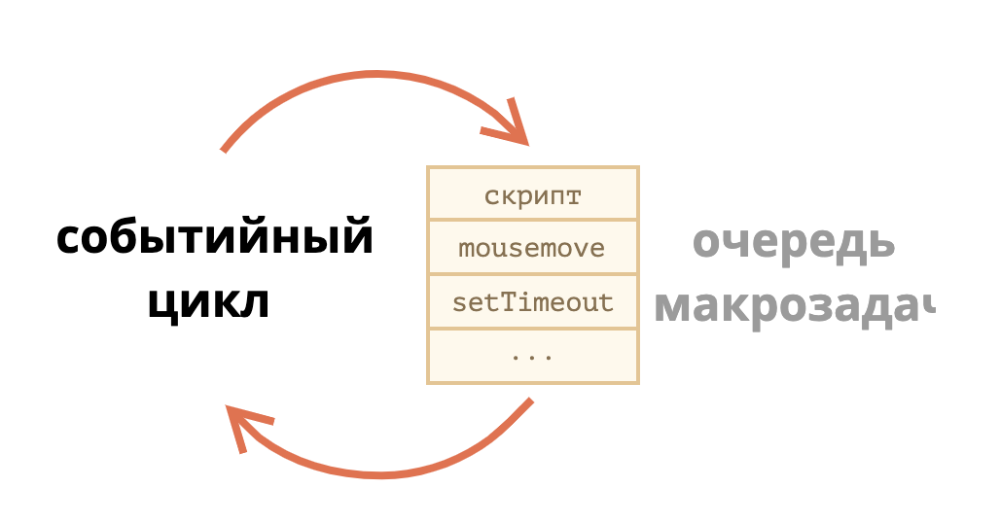

---

## Событийный цикл

## Общий алгоритм движка

1. Пока есть задачи:

выполнить их, начиная с самой старой

2. Бездействовать до появления новой задачи, а затем перейти к пункту 1

---

## Событийный цикл

x

### Пример для latentflip

Пример для `http://latentflip.com/loupe/?code=!!!PGJ1dHRvbj5DbGljayBtZSE8L2J1dHRvbj4%3D`

```
console.log("START");

setTimeout(function timeout2seconds() {
    console.log("timer 2 seconds");
}, 2000);

setTimeout(function timeout0seconds() {
    console.log("timer 0 seconds");
}, 0);

console.log("FINISH");
```

---

## Событийный цикл

### Примеры асинхронных задач

- Когда загружается внешний скрипт `<script src="...">`, то задача – это выполнение этого скрипта.
- Когда пользователь двигает мышь, задача – сгенерировать событие `mousemove` и выполнить его обработчики.
- Когда истечёт таймер, установленный с помощью `setTimeout(func, ...)`, задача – это выполнение функции `func`
- И так далее.

---

## Событийный цикл

### Пример 1: разбиение «тяжёлой» задачи.

```
let i = 0;

let start = Date.now();

function count() {

  // делаем тяжёлую работу
  for (let j = 0; j < 1e9; j++) {
    i++;
  }

  alert("Done in " + (Date.now() - start) + 'ms');
}

count();
```

---

## Событийный цикл

### Решение

```
let i = 0;

let start = Date.now();

function count() {

  // перенесём планирование очередного вызова в начало
  if (i < 1e9 - 1e6) {
    setTimeout(count); // запланировать новый вызов
  }

  do {
    i++;
  } while (i % 1e6 != 0);

  if (i == 1e9) {
    alert("Done in " + (Date.now() - start) + 'ms');
  }

}

count();
```

---

## Событийный цикл

### Макрозадачи и Микрозадачи

Микрозадачи приходят только из кода. Обычно они создаются промисами: выполнение обработчика .then/catch/finally становится микрозадачей.

- **Сразу после каждой макрозадачи движок исполняет все задачи из очереди микрозадач перед тем, как выполнить следующую макрозадачу или отобразить изменения на странице, или сделать что-то ещё.**

- **Все микрозадачи завершаются до обработки каких-либо событий или рендеринга, или перехода к другой макрозадаче.**

---

## Событийный цикл

Какая будет последовательность алертов?

```
setTimeout(() => alert("timeout"));
Какой здесь будет порядок?
Promise.resolve()
  .then(() => alert("promise"));

alert("code");
```

---

### Решение

- code появляется первым, т.к. это обычный синхронный вызов.
- promise появляется вторым, потому что .then проходит через очередь микрозадач и выполняется после текущего синхронного кода.
- timeout появляется последним, потому что это макрозадача.

---

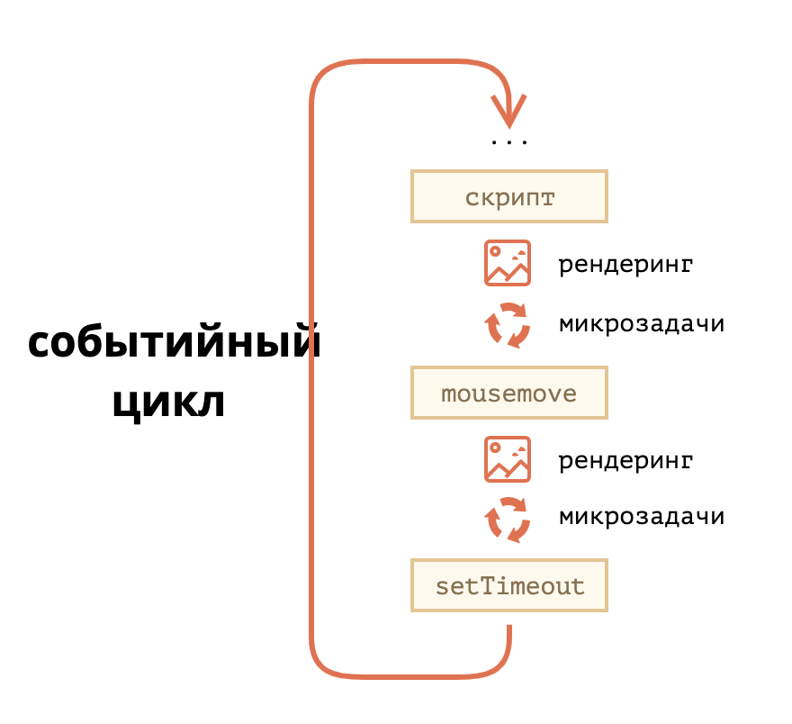

---

## Back to callback hell...


---

## Callback hell

Как нам загрузить два скрипта один за другим: сначала первый, а за ним второй?

```
loadScript('/my/script.js', function(script) {

  alert(`Здорово, скрипт ${script.src} загрузился, загрузим ещё один`);

  loadScript('/my/script2.js', function(script) {
    alert(`Здорово, второй скрипт загрузился`);
  });

```

---

## Callback hell

А что если нам нужно загрузить ещё один скрипт?

```
loadScript('1.js', function(error, script) {
  if (error) {
    handleError(error);
  } else {
    // ...
    loadScript('2.js', function(error, script) {
      if (error) {
        handleError(error);
      } else {
        // ...
        loadScript('3.js', function(error, script) {
          if (error) {
            handleError(error);
          } else {
            // ...и так далее, пока все скрипты не будут загружены (*)
          }
        });
      }
    })
  }
});
```

---

## Callback hell

Мы можем попытаться решить эту проблему, изолируя каждое действие в отдельную функцию, вот так:

```
loadScript('1.js', step1);

function step1(error, script) {
  if (error) {
    handleError(error);
  } else {
    // ...
    loadScript('2.js', step2);
  }
}

function step2(error, script) {
  if (error) {
    handleError(error);
  } else {
    // ...
    loadScript('3.js', step3);
  }
}
```

---

## Примеры из жизни

### Express JS

```
var express = require('express');
var app = express();

app.get('/', function (req, res) {
  res.send('Hello World!');
});

app.listen(3000, function () {
  console.log('Example app listening on port 3000!');
});
```

---

## Примеры из жизни

### MongoDB driver образца 2015 года (сейчас все на промисах)

```
login: function(user, pass, callback) {
    db.open(function (err, db) {
        if(!err) {
            db.collection("users", function(err, collection) {
                collection.findOne(
                    {
                        "username": user,
                        "password": pass
                    },
                    function(err, item) {
                        if(!err) {
                            callback(null,item);
                        } else {
                            callback("error");
                        }
                    }
                );
            });
        } else {
            callback("error",null);
        }
    });
}


user.login("test", "test", function(err,msg) {
    if( err ) {
      //error occured above;
    } else {
      //success
      console.log(msg);
    }
});
```

---

## Примеры из жизни

### React образца до появления хуков. setState.

```
this.setState({counter: 10}, (state, props) => {
  return {counter: state.counter + props.step};
});
```

---

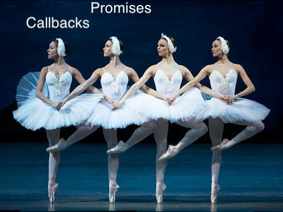

---

## Promises. Метафора с певцом.

Представьте, что вы известный певец, которого фанаты постоянно донимают расспросами о предстоящем сингле.

Чтобы получить передышку, вы обещаете разослать им сингл, когда он будет выпущен. Вы даёте фанатам список, в который они могут записаться. Они могут оставить там свой e-mail, чтобы получить песню, как только она выйдет. И даже больше: если что-то пойдёт не так, например, в студии будет пожар и песню выпустить не выйдет, они также получат уведомление об этом.


---

## Promises

```
let promise = new Promise(function(resolve, reject) {
  // функция-исполнитель (executor)
  // "певец"
});
```

- executor - функция, переданная в конструктор Promise
- resolve(value) — если работа завершилась успешно, с результатом value.
- reject(error) — если произошла ошибка, error – объект ошибки.

---

## Свойства объекта promise

```
let promise = new Promise(function(resolve, reject) {
  // функция-исполнитель (executor)
  // "певец"
});
```

- state («состояние»)

1. вначале "pending" («ожидание»)
2. потом меняется на "fulfilled" («выполнено успешно») при вызове resolve
3. "rejected" («выполнено с ошибкой») при вызове reject.

- result («результат»)

1. вначале undefined
2. далее изменяется на value при вызове resolve(value)
3. error при вызове reject(error).

---

## Картинка свойств объекта promise

```
let promise = new Promise(function(resolve, reject) {
  // функция-исполнитель (executor)
  // "певец"
});
```

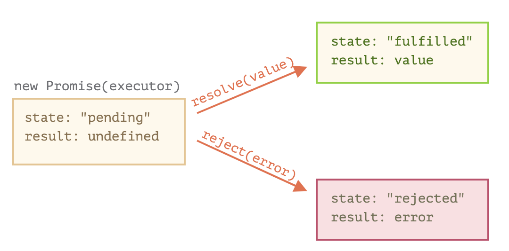

---

## Пример c resolve

```
let promise = new Promise(function(resolve, reject) {
  // эта функция выполнится автоматически, при вызове new Promise

  // через 1 секунду сигнализировать, что задача выполнена с результатом "done"
  setTimeout(() => resolve("done"), 1000);
});
```

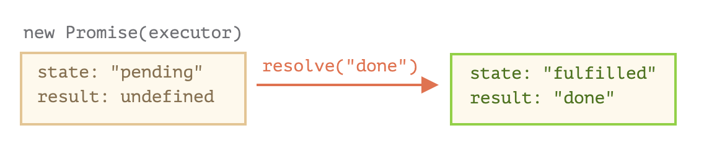

---

## Пример c reject

```
let promise = new Promise(function(resolve, reject) {
  // спустя одну секунду будет сообщено, что задача выполнена с ошибкой
  setTimeout(() => reject(new Error("Whoops!")), 1000);
});
```

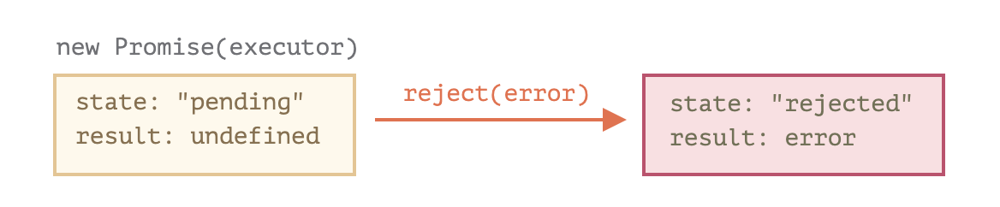

---

## Потребители: then, catch, finally

Объект Promise служит связующим звеном между исполнителем («создающим» кодом или «певцом») и функциями-потребителями («фанатами»), которые получат либо результат, либо ошибку. Функции-потребители могут быть зарегистрированы (подписаны) с помощью методов .then, .catch и .finally.

---

## then

```
promise.then(
  function(result) { /* обработает успешное выполнение */ },
  function(error) { /* обработает ошибку */ }
);
```

- Первый аргумент метода .then – функция, которая выполняется, когда промис переходит в состояние «выполнен успешно», и получает результат.

- Второй аргумент .then – функция, которая выполняется, когда промис переходит в состояние «выполнен с ошибкой», и получает ошибку.

---

### Примеры

1. Например, вот реакция на успешно выполненный промис:

```
let promise = new Promise(function(resolve, reject) {
  setTimeout(() => resolve("done!"), 1000);
});

// resolve запустит первую функцию, переданную в .then
promise.then(
  result => alert(result), // выведет "done!" через одну секунду
  error => alert(error) // не будет запущена
);
```

---

### Примеры

2. А в случае ошибки в промисе – выполнится вторая:

```
let promise = new Promise(function(resolve, reject) {
  setTimeout(() => reject(new Error("Whoops!")), 1000);
});

// reject запустит вторую функцию, переданную в .then
promise.then(
  result => alert(result), // не будет запущена
  error => alert(error) // выведет "Error: Whoops!" спустя одну секунду
);
```

---

## catch

Вызов .catch(f) – это сокращённый, «укороченный» вариант .then(null, f).

```
let promise = new Promise((resolve, reject) => {
  setTimeout(() => reject(new Error("Ошибка!")), 1000);
});

// .catch(f) это тоже самое, что promise.then(null, f)
promise.catch(alert); // выведет "Error: Ошибка!" спустя одну секунду
```

---

## finally

Блок finally выполнится в любом случае, если будет вызван resolve или reject

```
new Promise((resolve, reject) => {
  setTimeout(() => resolve("result"), 2000)
})
  .then(result => alert(result)); // <-- .then обработает результат
  .finally(() => alert("Промис завершён"))
```

finally хорошо подходит для очистки, например остановки индикатора загрузки, его ведь нужно остановить вне зависимости от результата.

---

## Promises vs Callbacks

```

```

| Промисы                                                                                                                                                | Колбэки                                                                                                                                                                       |
| ------------------------------------------------------------------------------------------------------------------------------------------------------ | ----------------------------------------------------------------------------------------------------------------------------------------------------------------------------- |
| Промисы позволяют делать вещи в естественном порядке. Сперва мы запускаем loadScript(script), и затем (.then) мы пишем, что делать с результатом.      | У нас должна быть функцияcallback на момент вызова loadScript(script, callback). Другими словами, нам нужно знать что делать с результатом до того, как вызовется loadScript. |
| Мы можем вызывать .then у Promise столько раз, сколько захотим. Каждый раз мы добавляем нового «фаната», новую функцию-подписчика в «список подписок». | Колбэк может быть только один.                                                                                                                                                |

```

```

---

## Fetch

JavaScript может отправлять сетевые запросы на сервер и подгружать новую информацию по мере необходимости.

Например, мы можем использовать сетевой запрос, чтобы:

- Отправить заказ,
- Загрузить информацию о пользователе,
- Запросить последние обновления с сервера,
- …и т.п.

---

## Fetch

Базовый синтаксис:

`let promise = fetch(url, [options])`

- url – URL для отправки запроса.
- options – дополнительные параметры: метод, заголовки и так далее.

---

## Fetch

Процесс получения ответа обычно происходит в два этапа.

**Во-первых, promise выполняется с объектом встроенного класса Response в качестве результата, как только сервер пришлёт заголовки ответа.**

Мы можем увидеть HTTP-статус в свойствах ответа:

- status – код статуса HTTP-запроса, например 200.
- ok – логическое значение: будет true, если код HTTP-статуса в диапазоне 200-299.

---

## Fetch

Например:

```
let response = await fetch(url);

if (response.ok) { // если HTTP-статус в диапазоне 200-299
  // получаем тело ответа (см. про этот метод ниже)
  let json = await response.json();
} else {
  alert("Ошибка HTTP: " + response.status);
}
```

---

## Fetch

**Во-вторых, для получения тела ответа нам нужно использовать дополнительный вызов метода.**

Response предоставляет несколько методов, основанных на промисах, для доступа к телу ответа в различных форматах:

- `response.text()` – читает ответ и возвращает как обычный текст,
- `response.json()` – декодирует ответ в формате `JSON`,
- `response.formData()` – возвращает ответ как объект FormData,
- `response.blob()` – возвращает объект как Blob (бинарные данные с типом),
- `response.arrayBuffer()` – возвращает ответ как `ArrayBuffer` (низкоуровневое представление бинарных данных),
  помимо этого, response.body – это объект `ReadableStream`, с помощью которого можно считывать тело запроса по частям.

---

## Fetch

Например, получим JSON-объект с последними коммитами из репозитория на GitHub:

```
let url = 'https://api.github.com/repos/javascript-tutorial/en.javascript.info/commits';
let response = await fetch(url);

let commits = await response.json(); // читаем ответ в формате JSON

alert(commits[0].author.login);
```

---

## POST-запросы

Для отправки POST-запроса или запроса с другим методом, нам необходимо использовать fetch параметры:

- method – HTTP метод, например POST,
- body – тело запроса, одно из списка:

1. строка (например, в формате JSON),
2. объект FormData для отправки данных как form/multipart,
3. Blob/BufferSource для отправки бинарных данных,
4. URLSearchParams для отправки данных в кодировке x-www-form-urlencoded, используется редко.

---

## Пример

```
let user = {
  name: 'John',
  surname: 'Smith'
};

let response = await fetch('/article/fetch/post/user', {
  method: 'POST',
  headers: {
    'Content-Type': 'application/json;charset=utf-8'
  },
  body: JSON.stringify(user)
});

let result = await response.json();
alert(result.message);
```

---

## Promise API

В классе Promise есть 5 статических методов.

1. Promise.all
2. Promise.allSettled
3. Promise.race
4. Promise.resolve/reject
5. Promise.reject

Из всех перечисленных методов, самый часто используемый – это, пожалуй, `Promise.all`

---

## Promise.all

Метод Promise.all принимает массив промисов (может принимать любой перебираемый объект, но обычно используется массив) и возвращает новый промис.

Новый промис завершится, когда завершится весь переданный список промисов, и его результатом будет массив их результатов.

```
Promise.all([
  new Promise(resolve => setTimeout(() => resolve(1), 3000)), // 1
  new Promise(resolve => setTimeout(() => resolve(2), 2000)), // 2
  new Promise(resolve => setTimeout(() => resolve(3), 1000))  // 3
]).then(alert); // когда все промисы выполнятся, результат будет 1,2,3
// каждый промис даёт элемент массива
```

!!! Если любой из промисов завершится с ошибкой, то промис, возвращённый Promise.all, немедленно завершается с этой ошибкой.

---

## Promise.allSettled

Метод Promise.allSettled всегда ждёт завершения всех промисов.

В массиве результатов будет

- {status:"fulfilled", value:результат} для успешных завершений,

- {status:"rejected", reason:ошибка} для ошибок.

---

## Пример

```
let urls = [
  'https://api.github.com/users/iliakan',
  'https://api.github.com/users/remy',
  'https://no-such-url'
];

Promise.allSettled(urls.map(url => fetch(url)))
  .then(results => { // (*)
    results.forEach((result, num) => {
      if (result.status == "fulfilled") {
        alert(`${urls[num]}: ${result.value.status}`);
      }
      if (result.status == "rejected") {
        alert(`${urls[num]}: ${result.reason}`);
      }
    });
  });
```

---

## Результат

```
[
  {status: 'fulfilled', value: ...объект ответа...},
  {status: 'fulfilled', value: ...объект ответа...},
  {status: 'rejected', reason: ...объект ошибки...}
]
```

---

## Promise.race

Метод очень похож на Promise.all, но ждёт только первый промис, из которого берёт результат (или ошибку).

```
Promise.race([
  new Promise((resolve, reject) => setTimeout(() => resolve(1), 1000)),
  new Promise((resolve, reject) => setTimeout(() => reject(new Error("Ошибка!")), 2000)),
  new Promise((resolve, reject) => setTimeout(() => resolve(3), 3000))
]).then(alert); // 1
```

---

## Promise.resolve

`Promise.resolve(value)` создаёт успешно выполненный промис с результатом `value`.

То же самое, что:

`let promise = new Promise(resolve => resolve(value));`

```
let cache = new Map();

function loadCached(url) {
  if (cache.has(url)) {
    return Promise.resolve(cache.get(url)); // (*)
  }

  return fetch(url)
    .then(response => response.text())
    .then(text => {
      cache.set(url,text);
      return text;
    });
}
```

---

## Promise.reject

`Promise.reject(error)` создаёт промис, завершённый с ошибкой `error`.

То же самое, что:

`let promise = new Promise((resolve, reject) => reject(error));`

На практике этот метод почти никогда не используется.

---

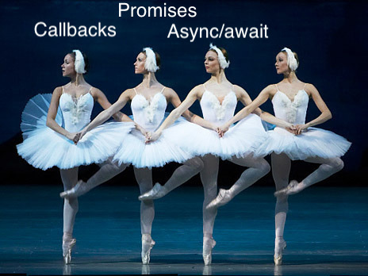

---

## Асинхронные функции

```
async function f() {
  return 1;
}
```

У слова async один простой смысл: эта функция всегда возвращает промис.

```
async function f() {
  return 1;
}

f().then(alert); // 1
```

Можно и явно вернуть промис, результат будет одинаковым:

```
async function f() {
  return Promise.resolve(1);
}

f().then(alert); // 1
```

---

## Await

```
// работает только внутри async–функций
let value = await promise;
```

Ключевое слово await заставит интерпретатор JavaScript ждать до тех пор, пока промис справа от await не выполнится. После чего оно вернёт его результат, и выполнение кода продолжится.

```
async function f() {

  let promise = new Promise((resolve, reject) => {
    setTimeout(() => resolve("готово!"), 1000)
  });

  let result = await promise; // будет ждать, пока промис не выполнится (*)

  alert(result); // "готово!"
}

f();
```

---

## Пример из жизни

```
async function showAvatar() {

  // запрашиваем JSON с данными пользователя
  let response = await fetch('/article/promise-chaining/user.json');
  let user = await response.json();

  // запрашиваем информацию об этом пользователе из github
  let githubResponse = await fetch(`https://api.github.com/users/${user.name}`);
  let githubUser = await githubResponse.json();

  // отображаем аватар пользователя
  let img = document.createElement('img');
  img.src = githubUser.avatar_url;
  img.className = "promise-avatar-example";
  document.body.append(img);

  // ждём 3 секунды и затем скрываем аватар
  await new Promise((resolve, reject) => setTimeout(resolve, 3000));

  img.remove();

  return githubUser;
}

showAvatar();
```

---

## Обработка ошибок

Такой код:

```
async function f() {
  await Promise.reject(new Error("Упс!"));
}
```

Делает тоже самое, что и такой:

```
async function f() {
  throw new Error("Упс!");
}
```

---

## Обработка ошибок

Такие ошибки можно ловить, используя `try..catch`, как с обычным `throw`:

```
async function f() {

  try {
    let response = await fetch('/no-user-here');
    let user = await response.json();
  } catch(err) {
    // перехватит любую ошибку в блоке try: и в fetch, и в response.json
    alert(err);
  }
}

f();
```

---

## `async/await` отлично работает с `Promise.all`

```
// await будет ждать массив с результатами выполнения всех промисов
let results = await Promise.all([
  fetch(url1),
  fetch(url2),
  ...
]);
```

---

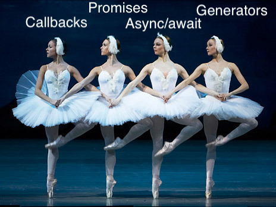

---

## Генераторы

Обычные функции возвращают только одно-единственное значение (или ничего).

Генераторы могут порождать (yield) множество значений одно за другим, по мере необходимости.

---

## Функция-генератор

Для объявления генератора используется специальная синтаксическая конструкция: `function*`, которая называется «функция-генератор».

Выглядит она так:

```
function* generateSequence() {
  yield 1;
  yield 2;
  return 3;
}
```

---

## Генераторы

Когда такая функция вызвана, она не выполняет свой код. Вместо этого она возвращает специальный объект, так называемый «генератор», для управления её выполнением.

```
function* generateSequence() {
  yield 1;
  yield 2;
  return 3;
}

// "функция-генератор" создаёт объект "генератор"
let generator = generateSequence();
alert(generator); // [object Generator]
```

---

## Генераторы

Выполнение кода функции ещё не началось:

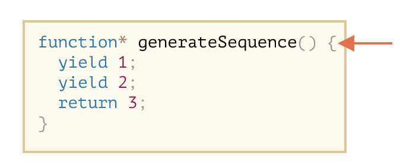

---

## Генераторы

Основным методом генератора является `next()`.

Результатом метода `next()` всегда является объект с двумя свойствами:

- value: значение из yield.
- done: true, если выполнение функции завершено, иначе false.

```
function* generateSequence() {
  yield 1;
  yield 2;
  return 3;
}

let generator = generateSequence();

let one = generator.next();

alert(JSON.stringify(one)); // {value: 1, done: false}
```

---

## Генераторы

На данный момент мы получили только первое значение, выполнение функции остановлено на второй строке:


---

## Генераторы

Повторный вызов generator.next() возобновит выполнение кода и вернёт результат следующего yield:

```
let two = generator.next();

alert(JSON.stringify(two)); // {value: 2, done: false}
```

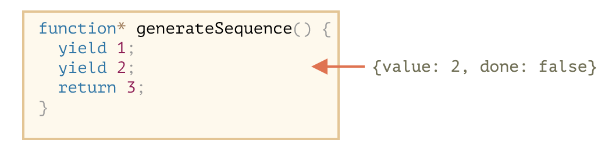

---

## Генераторы

И, наконец, последний вызов завершит выполнение функции и вернёт результат return:

```
let three = generator.next();

alert(JSON.stringify(three)); // {value: 3, done: true}
```

---

## Генераторы

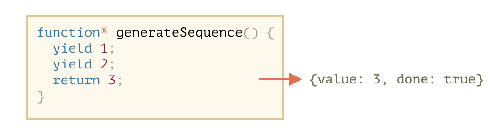

Сейчас генератор полностью выполнен. Мы можем увидеть это по свойству done:true и обработать value:3 как окончательный результат.

Новые вызовы generator.next() больше не имеют смысла. Впрочем, если они и будут, то не вызовут ошибки, но будут возвращать один и тот же объект: {done: true}.

---

## `yield` – дорога в обе стороны

`yield` – дорога в обе стороны: он не только возвращает результат наружу, но и может передавать значение извне в генератор.

Чтобы это сделать, нам нужно вызвать `generator.next(arg)` с аргументом. Этот аргумент становится результатом yield.

```
function* gen() {
  // Передаём вопрос во внешний код и ожидаем ответа
  let result = yield "2 + 2 = ?"; // (*)

  alert(result);
}

let generator = gen();

let question = generator.next().value; // <-- yield возвращает значение

generator.next(4); // --> передаём результат в генератор
```

---

## Генераторы

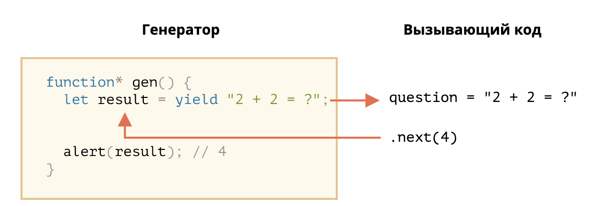

1. Первый вызов generator.next() – всегда без аргумента, он начинает выполнение и возвращает результат первого yield "2+2=?". На этой точке генератор приостанавливает выполнение.
2. Затем, как показано на картинке выше, результат yield переходит во внешний код в переменную question.
3. При generator.next(4) выполнение генератора возобновляется, а 4 выходит из присваивания как результат: let result = 4.

---

## Пример из жизни

```
import { put, takeEvery } from 'redux-saga/effects'

const delay = (ms) => new Promise(res => setTimeout(res, ms))

// ...

// Our worker Saga: will perform the async increment task
export function* incrementAsync() {
  yield delay(1000)
  yield put({ type: 'INCREMENT' })
}

// Our watcher Saga: spawn a new incrementAsync task on each INCREMENT_ASYNC
export function* watchIncrementAsync() {
  yield takeEvery('INCREMENT_ASYNC', incrementAsync)
}
```

---

# Спасибо за внимание 😀
